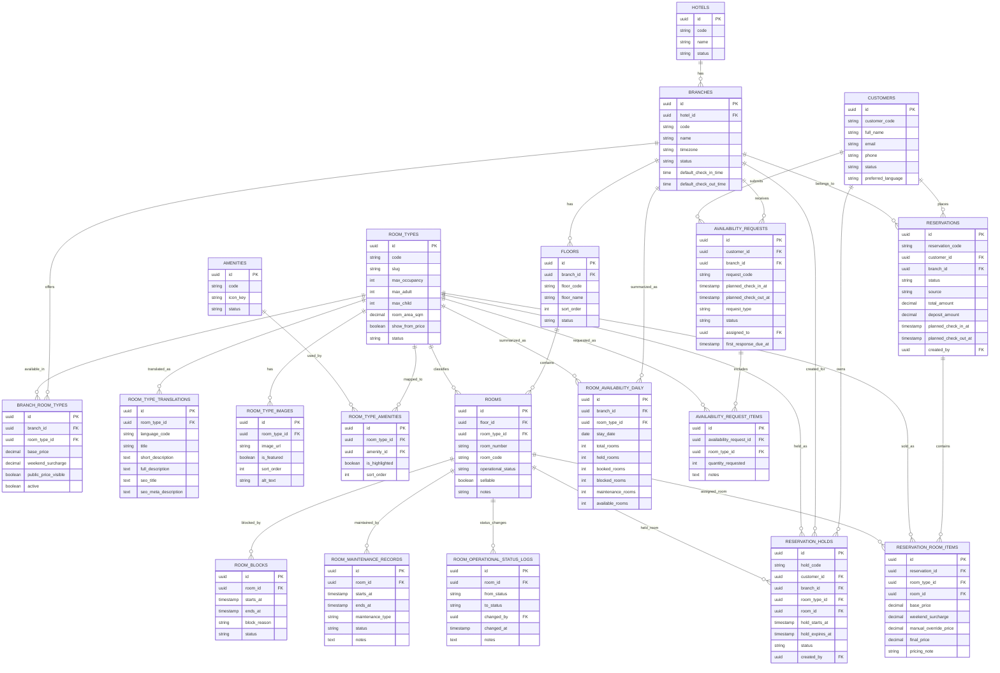
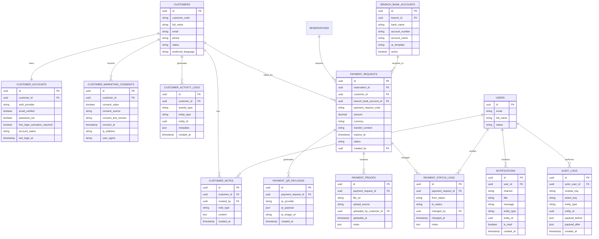
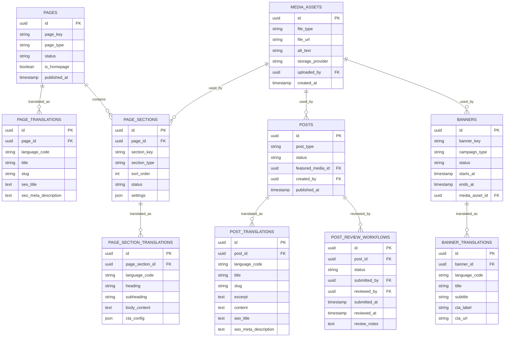

# SK boutique hotel – ERD Diagram, API List Draft, and Backlog Task Breakdown

Version: Draft v1  
Status: Working document  
Scope baseline: Phase 1 manual operations, future-ready for OTA and payment integration  
Language scope: Vietnamese / English

---

# 1. Document Purpose

This document extends the previously approved solution blueprint and BRD set for **SK boutique hotel**.

It provides three practical implementation artifacts:

1. **ERD diagrams** in Mermaid format for architecture and database discussion
2. **API list draft** for backend and frontend integration planning
3. **Backlog task breakdown** by phase and suggested development sprints

This document is intended for BA, PM, UI/UX, Backend, Frontend, QA, and DevOps alignment.

---

# 2. ERD – Diagram Overview

To keep the model readable, the ERD is split into 3 diagrams:

- **Diagram A:** Hotel structure, room inventory, availability, hold, reservation
- **Diagram B:** Customer, account, payment, notification, audit
- **Diagram C:** CMS, multilingual content, blog/news workflow

> Note: The diagrams below are implementation-oriented drafts, not final DDL.

---

# 3. ERD Diagram A – Hotel Structure, Inventory, Availability, Booking Core



---

# 4. ERD Diagram B – Customer Account, Marketing, Payment, Notification, Audit



---

# 5. ERD Diagram C – CMS, Multilingual Content, Offers, Blog/News Workflow



---

# 6. API Design Principles

## 6.1 General principles
- REST-first for phase 1
- JSON request/response format
- Authentication via secure session/JWT
- Public APIs separated from admin APIs
- Branch scoping enforced in admin APIs where applicable
- Audit logging on all important mutating admin endpoints
- Idempotent design for critical actions where possible
- Pagination, filtering, sorting supported on list endpoints

## 6.2 Base route proposal
- Public API: `/api/public/...`
- Customer/member API: `/api/member/...`
- Admin API: `/api/admin/...`
- System API/internal jobs: `/api/internal/...`

---

# 7. API List Draft – Public Website APIs

## 7.1 Site and content
- `GET /api/public/site-config`
- `GET /api/public/pages/:slug`
- `GET /api/public/homepage`
- `GET /api/public/branches`
- `GET /api/public/branches/:slug`
- `GET /api/public/room-types`
- `GET /api/public/room-types/:slug`
- `GET /api/public/offers`
- `GET /api/public/services`
- `GET /api/public/blog`
- `GET /api/public/blog/:slug`
- `GET /api/public/faqs`
- `GET /api/public/contact-settings`

## 7.2 Search and availability inquiry
- `POST /api/public/availability-requests`
- `POST /api/public/availability-requests/:requestCode/confirm-email-sent`
- `GET /api/public/room-types/:slug/availability-preview`
- `POST /api/public/hold-requests`

## 7.3 Marketing and member capture
- `POST /api/public/member-capture`
- `POST /api/public/newsletter-subscriptions`
- `POST /api/public/contact-requests`

## 7.4 Visitor analytics tracking
- `POST /api/public/track/page-view`
- `POST /api/public/track/room-view`
- `POST /api/public/track/gallery-click`
- `POST /api/public/track/check-availability-click`
- `POST /api/public/track/hold-room-click`
- `POST /api/public/track/map-click`

---

# 8. API List Draft – Member / Customer APIs

## 8.1 Authentication and account activation
- `POST /api/member/auth/login`
- `POST /api/member/auth/logout`
- `POST /api/member/auth/request-first-password-setup`
- `POST /api/member/auth/set-first-password`
- `POST /api/member/auth/request-password-reset`
- `POST /api/member/auth/reset-password`
- `GET /api/member/auth/me`

## 8.2 Profile and preferences
- `GET /api/member/profile`
- `PATCH /api/member/profile`
- `PATCH /api/member/preferences`
- `PATCH /api/member/marketing-consent`

## 8.3 History and bookings
- `GET /api/member/availability-requests`
- `GET /api/member/availability-requests/:requestCode`
- `GET /api/member/reservations`
- `GET /api/member/reservations/:reservationCode`
- `GET /api/member/payment-requests`
- `GET /api/member/payment-requests/:paymentRequestCode`
- `POST /api/member/payment-requests/:paymentRequestCode/proofs`

## 8.4 Notifications
- `GET /api/member/notifications`
- `PATCH /api/member/notifications/:id/read`

---

# 9. API List Draft – Admin APIs

## 9.1 Authentication and current user
- `POST /api/admin/auth/login`
- `POST /api/admin/auth/logout`
- `GET /api/admin/auth/me`
- `GET /api/admin/auth/permissions`

## 9.2 Dashboard and analytics
- `GET /api/admin/dashboard/overview`
- `GET /api/admin/dashboard/conversion`
- `GET /api/admin/dashboard/traffic-sources`
- `GET /api/admin/dashboard/branch-performance`
- `GET /api/admin/dashboard/room-performance`
- `GET /api/admin/dashboard/sla-status`

## 9.3 Branches, floors, rooms
- `GET /api/admin/branches`
- `POST /api/admin/branches`
- `GET /api/admin/branches/:id`
- `PATCH /api/admin/branches/:id`
- `GET /api/admin/branches/:id/floors`
- `POST /api/admin/branches/:id/floors`
- `GET /api/admin/floors/:id/rooms`
- `POST /api/admin/floors/:id/rooms`
- `PATCH /api/admin/rooms/:id`
- `PATCH /api/admin/rooms/:id/status`
- `POST /api/admin/rooms/:id/block`
- `POST /api/admin/rooms/:id/unblock`
- `POST /api/admin/rooms/:id/maintenance`

## 9.4 Room types and amenities
- `GET /api/admin/room-types`
- `POST /api/admin/room-types`
- `GET /api/admin/room-types/:id`
- `PATCH /api/admin/room-types/:id`
- `POST /api/admin/room-types/:id/translations`
- `POST /api/admin/room-types/:id/images`
- `DELETE /api/admin/room-type-images/:id`
- `POST /api/admin/room-types/:id/amenities`
- `POST /api/admin/room-types/:id/tags`
- `PATCH /api/admin/branch-room-types/:id/pricing`
- `PATCH /api/admin/branch-room-types/:id/public-visibility`

## 9.5 Availability requests
- `GET /api/admin/availability-requests`
- `GET /api/admin/availability-requests/:id`
- `PATCH /api/admin/availability-requests/:id/assign`
- `PATCH /api/admin/availability-requests/:id/status`
- `POST /api/admin/availability-requests/:id/notes`
- `POST /api/admin/availability-requests/:id/convert-to-hold`
- `POST /api/admin/availability-requests/:id/convert-to-reservation`

## 9.6 Holds and reservation workflow
- `GET /api/admin/holds`
- `GET /api/admin/holds/:id`
- `POST /api/admin/holds`
- `PATCH /api/admin/holds/:id/extend`
- `PATCH /api/admin/holds/:id/cancel`
- `GET /api/admin/reservations`
- `POST /api/admin/reservations`
- `GET /api/admin/reservations/:id`
- `PATCH /api/admin/reservations/:id`
- `PATCH /api/admin/reservations/:id/status`
- `POST /api/admin/reservations/:id/reassign-room`
- `POST /api/admin/reservations/:id/send-confirmation`
- `POST /api/admin/reservations/:id/generate-pdf`

## 9.7 Pricing and promotions
- `GET /api/admin/promotions`
- `POST /api/admin/promotions`
- `PATCH /api/admin/promotions/:id`
- `PATCH /api/admin/promotions/:id/status`
- `GET /api/admin/pricing-rules`
- `PATCH /api/admin/branch-room-types/:id/base-price`
- `PATCH /api/admin/branch-room-types/:id/weekend-surcharge`

## 9.8 Payment and deposit verification
- `GET /api/admin/payment-requests`
- `POST /api/admin/payment-requests`
- `GET /api/admin/payment-requests/:id`
- `POST /api/admin/payment-requests/:id/send`
- `GET /api/admin/payment-requests/:id/proofs`
- `PATCH /api/admin/payment-requests/:id/verify`
- `PATCH /api/admin/payment-requests/:id/reject`
- `PATCH /api/admin/payment-requests/:id/expire`
- `POST /api/admin/payment-requests/:id/regenerate-qr`

## 9.9 Customer/member management
- `GET /api/admin/customers`
- `GET /api/admin/customers/:id`
- `PATCH /api/admin/customers/:id`
- `POST /api/admin/customers/:id/notes`
- `GET /api/admin/customers/:id/activity`
- `GET /api/admin/customers/:id/reservations`
- `GET /api/admin/customers/:id/availability-requests`
- `PATCH /api/admin/customers/:id/marketing-consent`

## 9.10 CMS and blog workflow
- `GET /api/admin/pages`
- `POST /api/admin/pages`
- `GET /api/admin/pages/:id`
- `PATCH /api/admin/pages/:id`
- `POST /api/admin/pages/:id/sections`
- `PATCH /api/admin/page-sections/:id`
- `GET /api/admin/posts`
- `POST /api/admin/posts`
- `PATCH /api/admin/posts/:id`
- `POST /api/admin/posts/:id/submit-review`
- `PATCH /api/admin/posts/:id/approve`
- `PATCH /api/admin/posts/:id/reject`
- `GET /api/admin/banners`
- `POST /api/admin/banners`
- `PATCH /api/admin/banners/:id`

## 9.11 Users, roles, and configuration
- `GET /api/admin/users`
- `POST /api/admin/users`
- `PATCH /api/admin/users/:id`
- `GET /api/admin/roles`
- `POST /api/admin/roles`
- `PATCH /api/admin/roles/:id`
- `GET /api/admin/settings/general`
- `PATCH /api/admin/settings/general`
- `GET /api/admin/settings/booking`
- `PATCH /api/admin/settings/booking`
- `GET /api/admin/settings/payment`
- `PATCH /api/admin/settings/payment`
- `GET /api/admin/settings/notifications`
- `PATCH /api/admin/settings/notifications`

## 9.12 Audit and notifications
- `GET /api/admin/audit-logs`
- `GET /api/admin/notifications`
- `PATCH /api/admin/notifications/:id/read`

---

# 10. Internal / Job / Automation APIs

These may be implemented as queue workers, cron jobs, or internal services.

- `POST /api/internal/jobs/recompute-room-availability`
- `POST /api/internal/jobs/expire-holds`
- `POST /api/internal/jobs/expire-payment-requests`
- `POST /api/internal/jobs/escalate-sla`
- `POST /api/internal/jobs/send-booking-confirmation`
- `POST /api/internal/jobs/send-payment-reminders`
- `POST /api/internal/jobs/publish-scheduled-content`
- `POST /api/internal/jobs/build-daily-analytics-snapshot`

---

# 11. Suggested API Response Standards

## 11.1 Success response
```json
{
  "success": true,
  "data": {},
  "meta": {}
}
```

## 11.2 Error response
```json
{
  "success": false,
  "error": {
    "code": "VALIDATION_ERROR",
    "message": "Invalid check-in date",
    "details": {}
  }
}
```

## 11.3 Pagination response
```json
{
  "success": true,
  "data": [],
  "meta": {
    "page": 1,
    "pageSize": 20,
    "total": 143,
    "totalPages": 8
  }
}
```

---

# 12. Backlog Planning Principles

## 12.1 Sprint assumptions
Suggested execution model:
- 2-week sprint cadence
- 1 product owner / BA
- 1 UI/UX designer
- 1 frontend engineer
- 1 backend engineer
- 1 QA shared or part-time
- DevOps support as needed

## 12.2 Delivery philosophy
- Build the **core data model and auth foundation first**
- Prioritize **public website + content + room management** next
- Then implement **lead/hold/booking/payment operations**
- Keep OTA and full payment automation out of sprint 1–4

---

# 13. Phase Breakdown

## Phase A – Foundation and Architecture
Focus:
- project scaffolding
- auth/roles baseline
- data model setup
- branch/floor/room model
- core CMS foundation

## Phase B – Public Website and CMS
Focus:
- homepage
- branch pages
- room type listing/detail
- VI/EN content management
- offers/blog/services pages

## Phase C – Booking Operations
Focus:
- availability request
- hold flow
- manual reservation
- room suggestion
- SLA workflow

## Phase D – Deposit and Member Experience
Focus:
- member login flow
- history view
- payment request + QR
- proof upload
- confirmation email + PDF

## Phase E – Analytics, Audit, Hardening
Focus:
- dashboards
- content review workflow
- audit logs
- notification rules
- QA/UAT/performance hardening

---

# 14. Suggested Sprint Plan

## Sprint 0 – Discovery and Technical Setup
### Goal
Align requirements, environments, and implementation rules.

### Key tasks
- finalize sitemap and module boundaries
- finalize naming conventions and entity glossary
- set up repositories and environments
- set up CI/CD baseline
- initialize Next.js app and design system base
- initialize Supabase project, auth, storage, migrations
- define API standards and coding conventions

### Deliverables
- approved technical setup
- baseline repository structure
- migration framework
- component system skeleton

---

## Sprint 1 – Core Master Data and Admin Foundation
### Goal
Enable admin to manage branch, floor, room, room type, and role scaffolding.

### Backend
- create tables for hotels, branches, floors, rooms, room types
- create translation tables for room types
- create amenities and mapping tables
- create users, roles, permissions, branch assignments
- seed default statuses and enums

### Frontend/Admin
- login/logout admin shell
- branch management UI
- floor list and room grid by floor
- room type CRUD UI
- amenity mapping UI
- basic role assignment UI

### QA
- CRUD validation
- branch-scope authorization tests
- migration rollback tests

### Deliverables
- usable admin foundation
- physical room management baseline

---

## Sprint 2 – CMS and Multilingual Content
### Goal
Publish structured public content with VN/EN support.

### Backend
- create pages, page translations, page sections
- create media assets storage and upload endpoints
- create posts, post translations, banner tables
- create content publish status workflow

### Frontend/Public
- homepage layout shell
- room type listing page
- room type detail page
- branch detail page
- blog/news listing and detail pages
- VI/EN language switcher

### Frontend/Admin
- page builder-lite section ordering
- post editor basic form
- banner CRUD basic form
- translation management UI

### QA
- translation fallback tests
- SEO slug uniqueness tests
- media upload tests

### Deliverables
- public website content baseline
- VN/EN content management working

---

## Sprint 3 – Availability Request and Lead Capture
### Goal
Allow visitors to check room availability and create customer records.

### Backend
- create customer, account placeholder, consent, request tables
- create availability request and request item endpoints
- implement first-response SLA timestamps
- implement email notification dispatching
- implement tracking events for room/page/check actions

### Frontend/Public
- availability check form
- lead capture form embedded in check flow
- marketing consent checkbox flow
- success state and email confirmation message

### Frontend/Admin
- availability request inbox
- request detail page
- assignment and status update flow
- request notes

### QA
- duplicate customer handling tests
- consent logging tests
- email send tests
- SLA countdown tests

### Deliverables
- end-to-end request intake workflow
- lead/member capture baseline

---

## Sprint 4 – Hold Workflow and Manual Reservation Core
### Goal
Allow staff to hold a room and convert requests into bookings.

### Backend
- create hold tables and expiration jobs
- create reservation and reservation item tables
- implement room suggestion logic
- implement conflict detection by timestamp overlap
- implement auto-release expired hold job

### Frontend/Admin
- hold creation UI
- room suggestion panel
- manual room override selection
- reservation create/edit pages
- branch/floor room selection helper

### QA
- overlap and conflict tests
- expired hold tests
- status transition tests
- permission tests for extend/cancel hold

### Deliverables
- hold-room workflow
- manual booking core

---

## Sprint 5 – Pricing, Promotion, and Public Price Display
### Goal
Introduce practical price operations without full pricing engine complexity.

### Backend
- add branch_room_type pricing fields
- add promotion tables and simple rules
- calculate public from-price
- implement manual override priority logic

### Frontend/Public
- show/hide price toggle support
- render “From xxx / night” display
- promotion ribbon/tag rendering

### Frontend/Admin
- base price management
- weekend surcharge management
- simple promotion CRUD
- public price visibility setting

### QA
- price precedence tests
- weekend pricing tests
- public visibility toggle tests

### Deliverables
- usable pricing baseline
- simplified promotional logic

---

## Sprint 6 – Deposit QR, Payment Proof, Confirmation Email + PDF
### Goal
Support manual deposit collection and booking confirmation.

### Backend
- create branch bank account tables
- create payment request, QR payload, proof, status log tables
- implement dynamic VietQR payload generation
- implement secure proof upload link flow
- implement reservation confirmation email generation
- implement confirmation PDF generation
- implement auto-cancel expired pending deposit booking job

### Frontend/Public/Member
- payment request view page
- proof upload form via secure link
- member booking/payment detail page

### Frontend/Admin
- payment request create/send UI
- proof review UI
- verify/reject actions
- send confirmation action

### QA
- proof upload tests
- secure link expiry tests
- QR payload tests
- PDF generation validation
- auto-cancel tests

### Deliverables
- deposit workflow operational
- confirmation email and PDF operational

---

## Sprint 7 – Member Portal, History, and Notifications
### Goal
Give members visibility and give internal users actionable alerts.

### Backend
- finalize customer account activation flow
- first-login password setup flow
- member notification APIs
- reservation/request history APIs

### Frontend/Member
- login page
- first password setup page
- forgot/reset password pages
- request history page
- reservation history/detail page
- notification center basic UI

### Frontend/Admin
- in-app notifications list
- quick links from notifications to request/reservation/payment

### QA
- account activation tests
- history visibility tests
- notification permission tests

### Deliverables
- member portal operational
- history visibility delivered

---

## Sprint 8 – Dashboard, Audit Log, Content Review Workflow, UAT Hardening
### Goal
Complete the product for stakeholder review and operational launch.

### Backend
- audit log middleware/hooks
- analytics aggregation queries
- dashboard APIs
- post review workflow endpoints
- SLA escalation jobs

### Frontend/Admin
- dashboard overview with filters
- content approval workflow UI
- audit log explorer
- SLA risk widgets
- top room/branch interest widgets

### QA/UAT
- regression suite
- role matrix validation
- content workflow validation
- performance and responsive checks
- final UAT support

### Deliverables
- release candidate
- stakeholder demo-ready system

---

# 15. Detailed Backlog by Module

## 15.1 Auth and RBAC
### Epic
Authentication, branch-scoped authorization, and role-driven admin UI.

### Stories
- as an internal user, I can log in to the admin portal
- as a system admin, I can manage roles and permission assignments
- as an admin, I can assign branch access to managers and staff
- as a staff user, I can only see modules and records I am permitted to access
- as a customer, I can activate my account on first login

### Tasks
- create role/permission schema
- create permission constants per module
- implement middleware/guards
- implement admin session flow
- implement member session flow

---

## 15.2 Branch/Floor/Room Operations
### Epic
Model hotel inventory as physical rooms grouped by floor and room type.

### Stories
- as an admin, I can create branches
- as a manager, I can manage floors for my branch
- as staff, I can see a grid of rooms by floor
- as staff, I can mark a room as blocked or maintenance

### Tasks
- room status enum definitions
- floor room grid UI
- room detail drawer/modal
- maintenance/block forms
- room availability recalculation trigger

---

## 15.3 Room Type Content
### Epic
Manage premium public-facing room content in VN/EN.

### Stories
- as content admin, I can create room types in VI and EN
- as content admin, I can upload room galleries and choose featured image
- as visitor, I can view room details with amenities and gallery

### Tasks
- translation forms
- gallery uploader
- amenity/tag mapping
- SEO fields
- public render templates

---

## 15.4 Availability and Hold Workflow
### Epic
Capture room-check requests and convert them into operational holds.

### Stories
- as a visitor, I can check room availability
- as staff, I can assign myself or another staff member to a request
- as staff, I can create a hold with expiry
- as manager, I can see overdue or expired holds

### Tasks
- request form API
- SLA timestamps
- hold creation service
- expiry scheduler
- conflict detection service
- request-to-hold conversion action

---

## 15.5 Reservation Workflow
### Epic
Create manual reservations based on confirmed room availability.

### Stories
- as staff, I can create a reservation for one room
- as staff, I receive suggested rooms but can override selection
- as manager, I can cancel or reassign reservation room if allowed

### Tasks
- reservation schema
- room assignment logic
- reservation status machine
- calendar/list view for reservations
- confirmation action hooks

---

## 15.6 Pricing and Promotions
### Epic
Support practical selling price control without full revenue management complexity.

### Stories
- as admin, I can set base price per branch-room type
- as admin, I can add a weekend surcharge
- as staff, I can override price manually when creating reservation
- as marketer, I can create basic promotions

### Tasks
- price precedence function
- promotion rule schema
- admin forms
- public price rendering toggle
- pricing audit logging

---

## 15.7 Payment Request and Deposit Verification
### Epic
Manage deposit collection via dynamic QR and manual payment verification.

### Stories
- as staff, I can send a payment request with QR
- as a customer, I can upload transfer proof
- as staff, I can verify or reject payment proof
- as customer, I receive booking confirmation after verification

### Tasks
- payment request lifecycle
- QR payload generator
- secure upload link flow
- payment proof storage
- email template and PDF renderer
- expire-and-cancel job

---

## 15.8 Member Portal and Customer History
### Epic
Allow customers to revisit activity and reduce friction for future bookings.

### Stories
- as a member, I can log in and view my history
- as a member, I can see old room-check requests
- as a member, I can see booking and payment request status
- as staff, I can write notes on a customer profile

### Tasks
- profile page
- history endpoints
- member notification center
- note entry UI
- activity timeline

---

## 15.9 CMS, Blog, and Review Workflow
### Epic
Publish hotel content with moderation and multilingual control.

### Stories
- as a staff author, I can create a draft blog post
- as an admin, I can review and approve content
- as a visitor, I can read blog and offer pages in VN/EN

### Tasks
- post editor
- review states
- approval notifications
- translation handling
- publish scheduling optional hook

---

## 15.10 Analytics, Audit, and Monitoring
### Epic
Give management visibility into traffic, room interest, conversions, and user actions.

### Stories
- as admin, I can see dashboard metrics by date range
- as manager, I can filter dashboard by branch
- as system admin, I can inspect audit logs for sensitive changes

### Tasks
- event ingestion
- aggregation queries/materialized view strategy
- dashboard charts
- audit middleware
- export CSV optional hook

---

# 16. Suggested Non-Functional Backlog

## Security
- role and branch scoping tests
- secure file upload validation
- signed URL expiration
- password reset rate limiting
- audit trail for sensitive actions

## Performance
- image optimization pipeline
- list endpoint pagination and indexing
- dashboard query optimization
- caching for public content pages

## Reliability
- retryable email jobs
- background job observability
- failed job dashboard/logging
- backup and restore checklist

## Quality
- fixture/seed data for UAT
- end-to-end happy path scenarios
- multilingual regression tests
- responsive test matrix

---

# 17. Key Dependencies and Risks

## Dependencies
- final UI direction for premium hotel website style
- final room list and room type content from customer
- bank account and QR format confirmation by branch
- email provider setup and domain verification
- PDF template approval
- final permission mapping sign-off

## Risks
- content entry volume in VN/EN may delay publishing
- price policy ambiguity can expand scope quickly
- manual payment verification can create operational bottlenecks
- role matrix complexity may grow if branch exceptions multiply
- analytics expectations may become BI-level if not bounded early

---

# 18. Recommended Immediate Next Deliverables

After this document, the most practical next items are:

1. **Screen list / sitemap + admin navigation map**
2. **Wireframe set for public website and admin portal**
3. **Final PostgreSQL DDL draft**
4. **OpenAPI-style endpoint specification**
5. **Dev task board import version** in CSV or spreadsheet format
6. **ERD visual export** in polished PNG/PDF if needed for client presentation

---

# 19. Conclusion

This document translates the approved concept for **SK boutique hotel** into an implementation-oriented plan.

It keeps the product aligned with the agreed direction:
- premium public website
- operationally useful admin portal
- manual phase 1 booking and deposit flow
- room management based on physical rooms
- future-ready data model for OTA and automated payment expansion

The proposed ERD, API list, and sprint backlog are intentionally practical so the project can move from planning into UI, development, and delivery without rethinking the core structure again.
